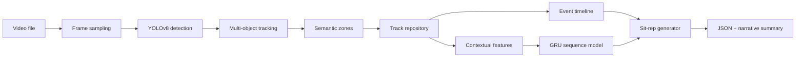

# Video Intelligence & AI Sit-Rep Generator

Turn security camera footage into **structured timelines** and **natural-language situational reports** (sit-reps) suitable for dispatch, law enforcement, or emergency review.

You feed in a video file. The system detects people and vehicles, tracks them over time, understands where they move on the property, estimates intrusion risk with machine learning, and produces a readable incident narrative — not just raw bounding boxes.

---

## What this project does

| Input | Output |
|-------|--------|
| `.mp4` / `.avi` / other OpenCV-readable video | JSON with activity counts, event timeline, risk probability, reasoning bullets, and a plain-English **summary** |

**Example use case:** A home invasion clip shows a vehicle arriving, people exiting, moving toward a door, and disappearing near the entry. The pipeline produces:

- **Who / what:** 3 unique people, 1 vehicle (deduplicated across frames, not per-frame double counts)
- **When:** A chronological timeline (`vehicle_arrival`, `person_exit_vehicle`, `approach_entry_point`, …)
- **How risky:** `intrusion_probability` from a learned sequence model
- **Why:** `intrusion_confidence_reasoning` bullet list
- **Sit-rep:** `summary` — a multi-paragraph narrative for a human operator

This is an **analytical aid**, not a legal determination. Investigators should always review source video.

---

## How it works (high level)



1. **Sample frames** from the video (default: every 0.5 seconds) until the file ends.
2. **Detect** people and vehicles with **YOLOv8** (Ultralytics).
3. **Track** objects with **DeepSORT** (or an IoU fallback if DeepSORT is not installed) so each person/vehicle keeps a stable ID.
4. **Map** detections into semantic zones: street/approach, driveway/transition, door/entry.
5. **Store** trajectories, entry/exit times, and velocity per track ID.
6. **Build** a structured event timeline from observable state changes (arrivals, zone transitions, proximity to vehicles, disappearance near entry).
7. **Classify** behavior over time with a **GRU** model trained on trajectory + zone features (or a data-relative fallback if no weights are loaded).
8. **Generate** reasoning bullets and a **law-enforcement-style narrative** from the timeline + model output.

---

## Repository layout

```
Startup Personal/
├── README.md                          ← you are here
├── intrusion_event_model.pt           ← primary model for the current pipeline (optional)
├── intrusion_model.pt                 ← legacy CNN+LSTM model (optional)
├── backend/
│   ├── pipeline.py                    ← main entry point: run analysis on a video
│   ├── video/
│   │   └── ingestion.py               ← OpenCV frame sampling
│   ├── detection/
│   │   └── yolo_detector.py           ← YOLOv8 wrapper (people + vehicles)
│   ├── tracking/
│   │   └── deepsort_tracker.py        ← DeepSORT / IoU identity tracking
│   ├── analysis/
│   │   ├── semantic_zones.py          ← vehicle / transition / entry zones
│   │   ├── track_repository.py        ← per-ID trajectories & lifecycle
│   │   ├── timeline_builder.py        ← structured event timeline
│   │   ├── contextual_features.py     ← zone occupancy features for ML
│   │   ├── learning_event_inference.py← GRU classifier + fallback scoring
│   │   ├── intrusion_reasoning.py     ← bullet-point explanations
│   │   └── train_event_model.py       ← train intrusion_event_model.pt
│   ├── reporting/
│   │   ├── law_enforcement_report.py  ← natural-language sit-rep
│   │   └── report_generator.py        ← legacy structured report helper
│   ├── notifications/
│   │   └── console_notifier.py        ← console alerts (extend for SMS/email)
│   └── ml_intrusion/                  ← legacy frame-based CNN+LSTM path
│       ├── model.py                   ← ResNet18 + LSTM
│       ├── train.py                   ← trains intrusion_model.pt
│       ├── inference.py               ← standalone inference on video/frames
│       └── data_loader.py             ← UCF Crime dataset loader
└── .vscode/launch.json                ← debug config for pipeline
```

---

## Two ML approaches (which one to use)

This repo contains **two** intrusion models. For day-to-day use, you only need **one**.

| | **Current (recommended)** | **Legacy** |
|---|---------------------------|------------|
| **Model file** | `intrusion_event_model.pt` | `intrusion_model.pt` |
| **Train script** | `backend.analysis.train_event_model` | `backend.ml_intrusion.train` |
| **Input** | YOLO + tracking + zone features over time | Raw video frames → ResNet18 features |
| **Architecture** | 12 trajectory features + 3 zone features → **GRU** | Frozen **ResNet18** → **LSTM** |
| **Used by** | `backend.pipeline` (main product) | `backend.ml_intrusion.inference` (standalone) |
| **Sit-rep / timeline** | Yes | No (probability only) |

**Use the current pipeline** unless you are experimenting with the older frame-only classifier.

---

## Quick start

### Prerequisites

- Python 3.9+ (3.10+ recommended)
- A machine with enough RAM for YOLO inference (GPU optional but faster)

Install dependencies (no `requirements.txt` is checked in; install what the code imports):

```powershell
pip install torch torchvision ultralytics opencv-python numpy
pip install deep-sort-realtime   # optional; improves tracking quality
```

On first run, YOLO downloads `yolov8n.pt` automatically.

### Analyze a video (main command)

From the project root:

```powershell
cd "C:\Users\yashy\Downloads\Startup Personal"
python -m backend.pipeline ".\path\to\your-video.mp4"
```

With an explicit model path:

```powershell
python -m backend.pipeline ".\path\to\your-video.mp4" intrusion_event_model.pt
```

If `intrusion_event_model.pt` is missing, the pipeline still runs using a **data-relative fallback** score and will note that in the output.

### Train the event model (optional)

Requires the **UCF Crime** frame dataset. Update the path in `backend/ml_intrusion/data_loader.py` (`DATASET_PATH`) if yours differs.

Expected layout:

```
UCF Crime Dataset/
  Train/
    Burglary/
    NormalVideos/
  Test/
    Burglary/
    NormalVideos/
```

**Full training** (slow on CPU — start small first):

```powershell
python -m backend.analysis.train_event_model
```

**Quick smoke test** (fewer frames, 1 epoch):

```powershell
python -c "from backend.analysis.train_event_model import train_event_model; train_event_model(epochs=1, sample_max_frames=20)"
```

Output: `intrusion_event_model.pt` in the project root.

### Legacy model (optional, not required for sit-reps)

```powershell
python -m backend.ml_intrusion.train
python -m backend.ml_intrusion.inference ".\path\to\video.mp4"
```

---

## Output format

Running the pipeline prints JSON similar to:

```json
{
  "video": ".\\Home Invaision Video.mp4",
  "frames_analyzed": 42,
  "last_timestamp_sec": 20.5,
  "intrusion_probability": 0.87,
  "intrusion_confidence_reasoning": [
    "At least one vehicle was observed in the scene during the recording period.",
    "3 distinct individual(s) were tracked (deduplicated across frames).",
    "Tracked persons showed movement toward the designated entry area.",
    "The behavioral risk estimate from the sequence model is 87% ..."
  ],
  "summary": "At approximately 00:02, a vehicle was first observed...\n\n...",
  "activity": {
    "unique_people": 3,
    "unique_vehicles": 1
  },
  "timeline": [
    { "timestamp": "00:02", "event": "vehicle_arrival", "vehicle_id": 1 },
    { "timestamp": "00:05", "event": "person_exit_vehicle", "person_id": 2, "vehicle_id": 1 },
    { "timestamp": "00:08", "event": "approach_entry_point", "person_id": 2 }
  ],
  "tracks": { "people": { ... }, "vehicles": { ... } },
  "model": {
    "used_learned_weights": true,
    "sequence_feature_length": 42,
    "decision_threshold": 0.5
  }
}
```

| Field | Meaning |
|-------|---------|
| `activity.unique_people` / `unique_vehicles` | Deduplicated track counts (not per-frame totals) |
| `timeline` | Ordered events with `MM:SS` timestamps and stable IDs |
| `intrusion_probability` | Learned or fallback risk estimate in `[0, 1]` |
| `intrusion_confidence_reasoning` | Human-readable bullets supporting the estimate |
| `summary` | Full sit-rep narrative for operators / investigators |
| `tracks` | Per-ID trajectories with zones and velocity |

---

## Key design decisions

### Why YOLO + tracking?

Raw per-frame detection **double-counts** the same person many times. Tracking assigns persistent `person_id` / `vehicle_id` values so counts and timelines refer to **unique individuals** across the clip.

### Why semantic zones?

Zones (`vehicle_zone`, `transition_zone`, `entry_zone`) encode **where** behavior happens. They are normalized rectangles (tunable per camera) used for timeline events and ML features — not hardcoded “if 3 people then alert” rules.

### Why a sequence model?

Intrusion is a **temporal** pattern: arrive → exit vehicle → approach door → disappear. A GRU over per-frame contextual features learns these patterns from labeled data (UCF Burglary vs Normal) instead of brittle hand-tuned thresholds.

### How sit-reps are generated

1. **`timeline_builder.py`** — derives events from track geometry (zone changes, vehicle proximity, last-seen location).
2. **`intrusion_reasoning.py`** — turns timeline facts + probability into bullet points.
3. **`law_enforcement_report.py`** — stitches bullets and timeline into a multi-paragraph narrative.

No LLM is required for the MVP narrative; it is template-driven from structured events. You can swap in an LLM later for richer prose.

---

## Configuration

| Setting | Location | Default |
|---------|----------|---------|
| Frame sample interval | `run_pipeline(sample_interval=...)` | `0.5` seconds |
| YOLO weights | `YoloV8Detector(model_path=...)` | `yolov8n.pt` |
| Event model | CLI arg or `event_model_path=` | `intrusion_event_model.pt` |
| Semantic zones | `default_semantic_zones()` in `semantic_zones.py` | Normalized rectangles for a typical front-door camera |
| Training dataset | `DATASET_PATH` in `data_loader.py` | UCF Crime path on your machine |

Calibrate zones for your camera angle before production deployment.

---

## Debugging in VS Code

`.vscode/launch.json` includes a **Python Debugger: Module** config that runs `backend.pipeline` against a sample video. Adjust the video path in `args` to match your file.

---

## Limitations & disclaimer

- **Camera-specific:** Default zones assume a typical property layout; misaligned zones weaken timeline quality.
- **Sampling:** Events between sampled frames may be missed; decrease `sample_interval` for finer resolution at higher compute cost.
- **Tracking:** Occlusion, low light, and crowded scenes can swap or drop IDs.
- **Model scope:** Trained on UCF Crime (burglary vs normal); generalization to new environments is not guaranteed.
- **Not evidence:** Output is decision support. Always verify against original footage.

---

## Further reading

- `backend/README_EVENT_INTEL.md` — short module reference for the analysis pipeline stages.

---

## One-line pitch

**Upload surveillance video → get an AI-generated situational report with who showed up, what they did, when it happened, and how concerning it looks — backed by tracking, timelines, and learned behavior models.**
